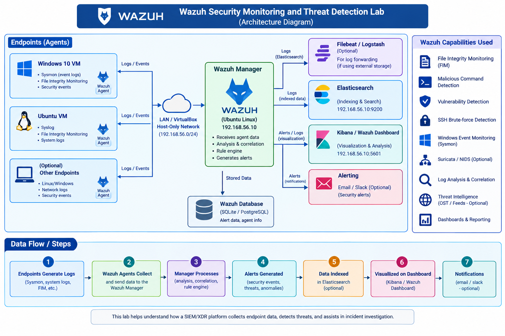
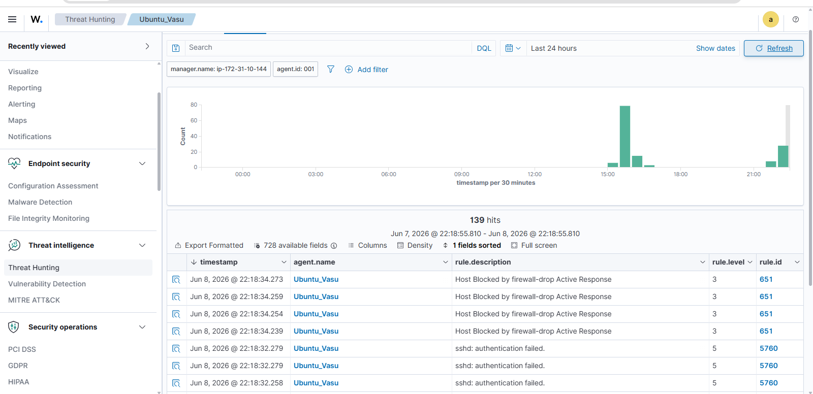
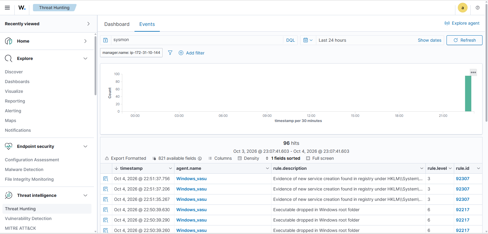
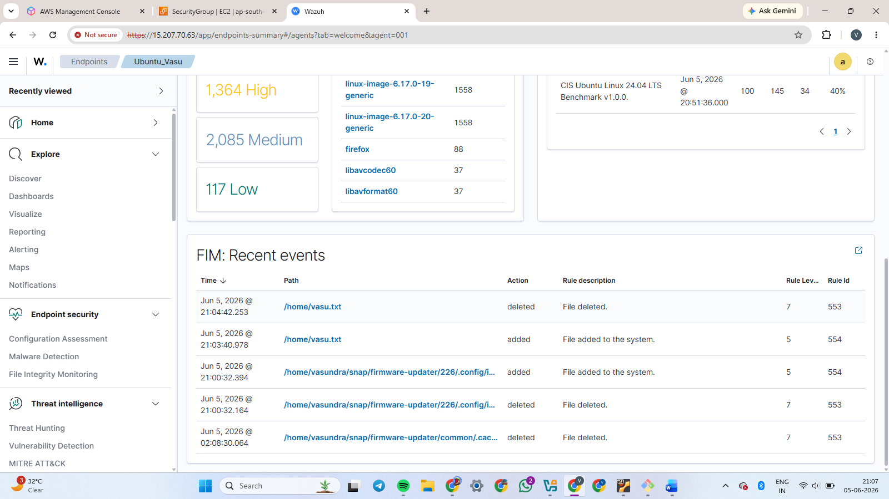
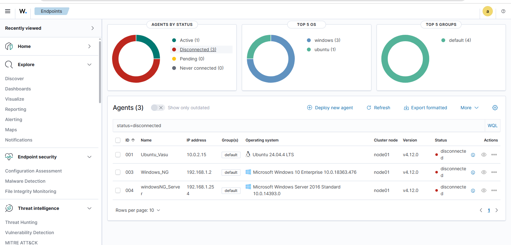
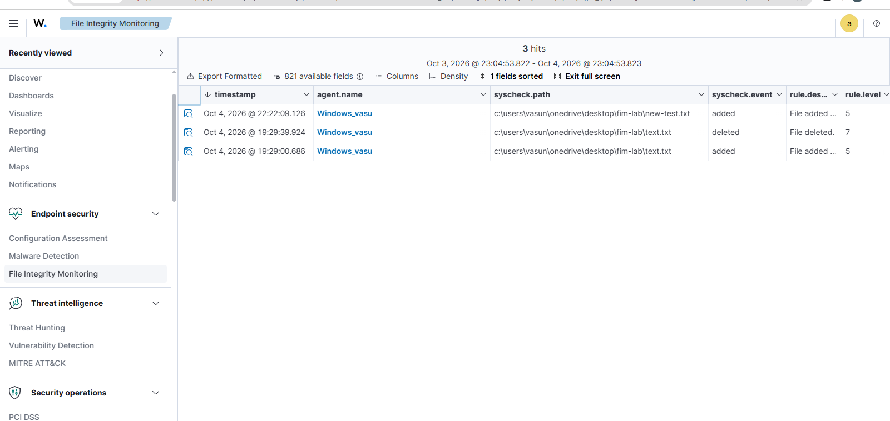

# Wazuh Security Monitoring and Threat Detection Lab

## Project Overview

This project demonstrates a practical Security Operations Center (SOC) monitoring and threat detection lab using **Wazuh**.

The project focuses on endpoint monitoring, file integrity monitoring, Windows security event monitoring, Sysmon integration, vulnerability detection, and detection of suspicious activities.

The lab was designed to understand how a SIEM/XDR platform can collect endpoint security data, generate alerts, and help security analysts investigate potential threats.

---

## Objectives

- Monitor Windows endpoint and Ubuntu endpoint security events
- Configure Wazuh Agent for endpoint monitoring
- Implement File Integrity Monitoring (FIM)
- Integrate Windows Sysmon logs with Wazuh
- Monitor suspicious processes and PowerShell activity
- Detect failed authentication attempts
- Monitor user and system activity
- Perform vulnerability detection
- Understand security alerts and event analysis
- Practice SOC alert investigation and incident analysis

---

## Project Architecture

         
                    Wazuh Agent
                         │
             ┌─────────────────────┐
                              	 
          Ubuntu                 Windows
                                    
             └─────────────────────┘
                         │
                         ▼
                  Wazuh Manager
                         │
                         ▼
                  Wazuh Dashboard
                         │
                         ▼
              Security Alerts / Analysis

## Key Implementations

### 1. File Integrity Monitoring (FIM)
Configured Wazuh FIM to monitor important Linux directories:

/etc
/usr/bin
/usr/sbin
/bin
/sbin
/boot
/home

Real-time monitoring and change reporting were enabled for the /home directory.

FIM helps detect:

File creation
File modification
File deletion
Unauthorized file changes

### 2. Linux Audit Monitoring

Configured Wazuh Agent to collect Linux Audit Framework logs from:

/var/log/audit/audit.log

This provides visibility into security-related activity on the Linux endpoint.

### 3. Active Response

Enabled Wazuh Active Response functionality.

Active Response can be used to automatically respond to detected security events based on configured rules and response actions.

### 4. Suricata Integration

Configured Wazuh Agent to collect Suricata JSON events from:

/var/log/suricata/eve.json

This allows network security events generated by Suricata to be monitored through Wazuh.

### 5. Sysmon Integration

Integrated **Microsoft Sysmon** to collect detailed Windows system activity and security telemetry.

Sysmon provides visibility into activities such as:

- Process creation
- Process termination
- Network connections
- PowerShell activity
- File and system activity

Sysmon events can be collected and analyzed through Wazuh to improve endpoint visibility and support security alert investigation.

## Project Features

### Endpoint Monitoring

Monitors Windows endpoint activity through the Wazuh Agent.

### File Integrity Monitoring

Detects changes to monitored files and directories.

### Sysmon Monitoring

Provides detailed Windows process and system activity.

### Security Event Monitoring

Collects and analyzes Windows security events.

### Authentication Monitoring

Helps identify failed and suspicious login activity.

### Process Monitoring

Monitors process activity and helps identify suspicious or unusual processes using endpoint security telemetry and Sysmon events.

## Screenshots

### Active-response

### ssh-bruteforce-active-response

### Sysmon-threat-hunting

### Ubuntu-fim-alerts

### Wazuh-agents-overview

### Windows-fim-alerts

## Project Outcome

Through this project, I gained practical experience in endpoint security monitoring and SOC operations using Wazuh.

The project helped me understand how security events are collected from Windows and ubuntu endpoints, how Sysmon provides detailed telemetry, how File Integrity Monitoring detects changes, and how security alerts can be investigated.

It also provided hands-on exposure to alert triage, endpoint monitoring, vulnerability detection, and MITRE ATT&CK-based security analysis.

## Project Structure

wazuh-security-monitoring-lab/
│
├── README.md
│
├── wazuh-config/
│   └── ossec.conf
│
└── screenshots/
    ├── active-response.png
    ├── ssh-bruteforce-active-response.png
    ├── sysmon-threat-hunting.png
    ├── ubuntu-fim-alerts.png
    ├── wazuh-agents-overview.png
    ├── windows-fim-alerts.png
    └── architecture.png# wazuh-security-monitoring-lab
Hands-on Wazuh security monitoring lab covering File Integrity Monitoring (FIM), Linux Audit, Active Response, and Suricata integration.
